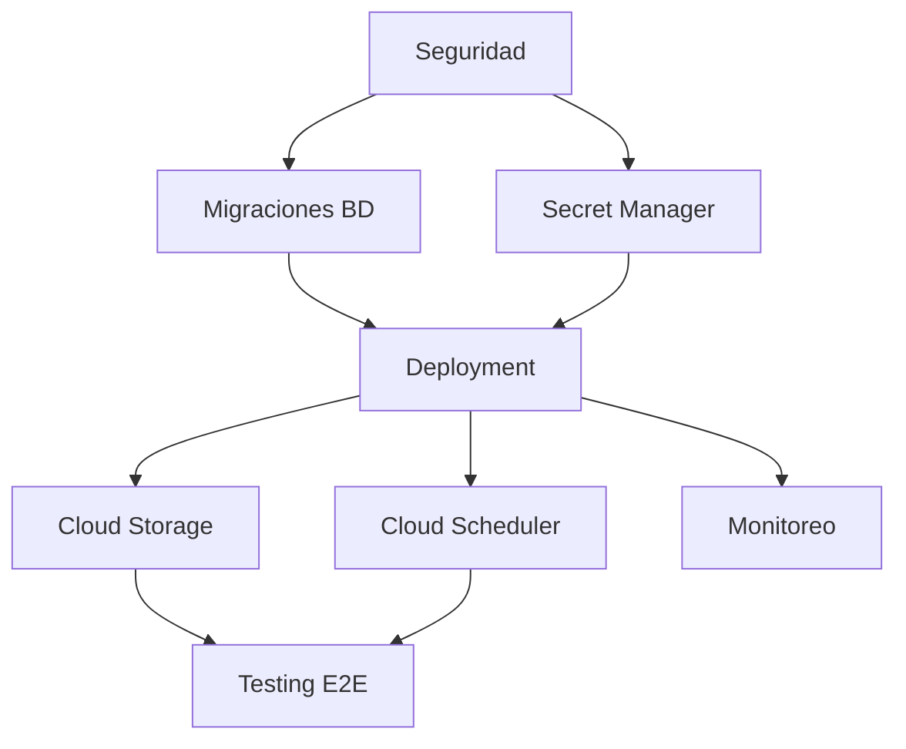

# 📋 CHECKLIST RÁPIDO DE DESPLIEGUE A PRODUCCIÓN

**Sistema GMAO - Lista de verificación ejecutiva**

---

## ⏱️ TIMELINE EJECUTIVO

| Fase | Días | Prioridad | Bloqueante |
|------|------|-----------|------------|
| 1. Seguridad | 1-2 | 🔴 Alta | Sí |
| 2. Migraciones BD | 1 | 🔴 Alta | Sí |
| 3. Secret Manager | 1 | 🔴 Alta | Sí |
| 4. Cloud Storage | 2 | 🟡 Media | No |
| 5. Cloud Scheduler | 2-3 | 🟡 Media | No |
| 6. Testing | 2 | 🟡 Media | No |
| 7. Deployment | 2 | 🟢 Baja | Sí |
| 8. Monitoreo | 1 | 🟢 Baja | No |
| **TOTAL** | **12-14 días** | | |

---

## 🎯 RUTA CRÍTICA (MÍNIMO VIABLE)

Si necesitas desplegar **URGENTEMENTE** (3-4 días):

### Día 1: Seguridad Básica
```bash
[✅] Cambiar SESSION_COOKIE_SECURE a dinámico
[✅] Rotar SECRET_KEY
[✅] Eliminar credenciales de .env.example
[✅] Implementar CSRF Protection básico
```

### Día 2: Base de Datos
```bash
[✅] Instalar Flask-Migrate
[✅] Crear migración inicial
[✅] Configurar Cloud SQL
[✅] Aplicar migraciones en producción
```

### Día 3: Secrets y Deployment
```bash
[✅] Crear secrets en GCP Secret Manager
[✅] Actualizar app.yaml
[✅] Actualizar factory.py
[✅] Primer deployment a staging
```

### Día 4: Go-Live
```bash
[✅] Tests de smoke
[✅] Deployment a producción
[✅] Monitoreo básico
[✅] Backup manual de BD
```

**⚠️ NOTA:** Esta ruta crítica deja pendientes:
- Cloud Storage (uploads se perderán al reiniciar)
- Cloud Scheduler (generación manual de órdenes)
- Tests automatizados (riesgo medio)
- Monitoreo avanzado (sin alertas)

---

## 📦 DEPENDENCIAS Y ORDEN



---

## 🔴 FASE 1: SEGURIDAD (2 días)

### Checklist Detallado

#### ✅ 1.1 CSRF Protection
```bash
[ ] Añadir csrf a app/extensions.py
[ ] Inicializar csrf en factory.py
[ ] Probar en formulario de login
[ ] Verificar token en requests POST
```

**Comando de verificación:**
```bash
curl -X POST http://localhost:5000/api/test
# Debe retornar 400 CSRF token missing
```

#### ✅ 1.2 SESSION_COOKIE_SECURE
```bash
[ ] Modificar línea 82 de app/factory.py
[ ] Añadir detección de entorno
[ ] Probar en desarrollo (debe ser False)
[ ] Probar en producción simulada (debe ser True)
```

**Archivo a modificar:** `app/factory.py:82`

#### ✅ 1.3 Rate Limiting
```bash
[ ] pip install Flask-Limiter
[ ] Añadir limiter a extensions.py
[ ] Inicializar en factory.py
[ ] Aplicar decorator en /login
[ ] Probar con 10 requests rápidas
```

**Test:**
```bash
for i in {1..10}; do curl http://localhost:5000/usuarios/login; done
```

#### ✅ 1.4 Credenciales
```bash
[ ] Abrir .env.example
[ ] Reemplazar j_hidalgo@disfood.com
[ ] Reemplazar dvematimfpjjpxji
[ ] Commit y push
[ ] Rotar contraseña en Gmail
```

**⚠️ CRÍTICO:** Si ya está en GitHub, rotar inmediatamente.

---

## 🔴 FASE 2: MIGRACIONES (1 día)

### Checklist Detallado

#### ✅ 2.1 Instalación
```bash
[ ] pip install Flask-Migrate==4.0.7
[ ] pip freeze > requirements.txt
[ ] Verificar requirements.txt actualizado
```

#### ✅ 2.2 Configuración
```bash
[ ] Añadir migrate a app/extensions.py
[ ] Inicializar migrate en factory.py
[ ] Verificar logs de inicialización
```

#### ✅ 2.3 Creación de Migraciones
```bash
[ ] flask db init
[ ] flask db migrate -m "Migración inicial"
[ ] Revisar archivo generado en migrations/versions/
[ ] flask db upgrade
[ ] flask db current (verificar)
```

#### ✅ 2.4 Pruebas
```bash
[ ] Modificar un modelo (añadir campo)
[ ] flask db migrate -m "Test campo"
[ ] flask db upgrade
[ ] flask db downgrade (rollback)
[ ] flask db upgrade (re-aplicar)
```

---

## 🔴 FASE 3: SECRET MANAGER (1 día)

### Checklist Detallado

#### ✅ 3.1 Generar Secrets
```bash
[ ] python -c "import secrets; print(secrets.token_hex(32))" > secret_key.txt
[ ] Crear db_password.txt (contraseña PostgreSQL)
[ ] Crear mail_password.txt (contraseña Gmail)
[ ] Crear sentry_dsn.txt (DSN de Sentry - opcional)
```

#### ✅ 3.2 Crear en GCP
```bash
[ ] gcloud secrets create gmao-secret-key --data-file=secret_key.txt
[ ] gcloud secrets create gmao-db-password --data-file=db_password.txt
[ ] gcloud secrets create gmao-mail-password --data-file=mail_password.txt
[ ] Configurar permisos (serviceAccount)
[ ] Listar secrets: gcloud secrets list
```

#### ✅ 3.3 Actualizar Código
```bash
[ ] Actualizar app.yaml con referencias
[ ] Actualizar factory.py con get_secret()
[ ] Crear .env.production.template
[ ] Probar acceso a secrets localmente
```

**Test de acceso:**
```bash
gcloud secrets versions access latest --secret="gmao-secret-key"
```

---

## 🟡 FASE 4: CLOUD STORAGE (2 días)

### Checklist Detallado

#### ✅ 4.1 Crear Bucket
```bash
[ ] gsutil mb -p gmao-sistema gs://gmao-sistema-uploads
[ ] Configurar CORS (cors-config.json)
[ ] Configurar lifecycle (lifecycle-config.json)
[ ] Verificar permisos (privado por defecto)
```

#### ✅ 4.2 Implementar StorageManager
```bash
[ ] Crear app/utils/storage.py
[ ] Copiar clase StorageManager completa
[ ] Inicializar en factory.py
[ ] Probar save_file() localmente
```

#### ✅ 4.3 Migrar Controladores
```bash
[ ] Actualizar archivos_controller.py
[ ] Actualizar manuales_controller.py
[ ] Actualizar ordenes_controller.py (adjuntos)
[ ] Probar upload/download
```

---

## 🟡 FASE 5: CLOUD SCHEDULER (2-3 días)

### Checklist Detallado

#### ✅ 5.1 Crear Endpoint
```bash
[ ] Añadir /api/generar-ordenes-automaticas en planes.py
[ ] Implementar verificación de token
[ ] Copiar lógica de scheduler_apscheduler.py
[ ] Probar endpoint localmente con curl
```

#### ✅ 5.2 Configurar Token
```bash
[ ] Generar token: python -c "import secrets; print(secrets.token_urlsafe(32))"
[ ] Crear secret: gcloud secrets create gmao-scheduler-token
[ ] Actualizar app.yaml y factory.py
[ ] Verificar acceso al secret
```

#### ✅ 5.3 Crear Jobs
```bash
[ ] gcloud services enable cloudscheduler.googleapis.com
[ ] Crear job diario (6:00 AM)
[ ] Crear job verificación (cada 12h)
[ ] Probar manualmente: gcloud scheduler jobs run ...
[ ] Ver logs de ejecución
```

---

## 🟡 FASE 6: TESTING (2 días)

### Checklist Detallado

#### ✅ 6.1 Configuración
```bash
[ ] pip install pytest pytest-flask pytest-cov pytest-mock
[ ] Crear pytest.ini
[ ] Crear conftest.py con fixtures
[ ] Verificar: pytest --collect-only
```

#### ✅ 6.2 Tests de Seguridad
```bash
[ ] Crear tests/test_security.py
[ ] Test: CSRF enabled
[ ] Test: SESSION_COOKIE_SECURE
[ ] Test: SECRET_KEY no es default
[ ] Test: Rate limiting
[ ] Test: SQL injection protection
[ ] Test: XSS protection
```

**Ejecutar:**
```bash
pytest tests/test_security.py -v -m security
```

#### ✅ 6.3 Tests de Integración
```bash
[ ] Crear tests/test_integration_ordenes.py
[ ] Test: Flujo completo crear orden
[ ] Test: Generación automática
[ ] pytest -v -m integration
```

#### ✅ 6.4 CI/CD
```bash
[ ] Actualizar cloudbuild.yaml
[ ] Descomentar sección de tests
[ ] Añadir coverage mínimo 70%
[ ] Commit y push
[ ] Verificar build en GCP
```

---

## 🟢 FASE 7: DEPLOYMENT (2 días)

### Checklist Detallado

#### ✅ 7.1 Pre-Deployment
```bash
[ ] .env completo y .gitignore actualizado
[ ] requirements.txt actualizado
[ ] Migraciones listas
[ ] Tests pasando (pytest)
[ ] Secrets en GCP verificados
[ ] Proyecto GCP creado y billing habilitado
```

#### ✅ 7.2 Habilitar APIs
```bash
[ ] gcloud services enable appengine.googleapis.com
[ ] gcloud services enable cloudbuild.googleapis.com
[ ] gcloud services enable sqladmin.googleapis.com
[ ] gcloud services enable secretmanager.googleapis.com
[ ] gcloud services enable storage-api.googleapis.com
```

#### ✅ 7.3 Cloud SQL
```bash
[ ] gcloud sql instances create gmao-postgres
[ ] gcloud sql databases create postgres
[ ] gcloud sql users create postgres
[ ] Obtener connection name
[ ] Actualizar app.yaml con connection name
```

#### ✅ 7.4 Migraciones en Producción
```bash
[ ] Iniciar cloud_sql_proxy
[ ] Configurar DATABASE_URL
[ ] flask db upgrade
[ ] flask db current (verificar)
```

#### ✅ 7.5 Deployment
```bash
[ ] Crear scripts/deploy.sh
[ ] Ejecutar: ./scripts/deploy.sh
[ ] O manualmente: gcloud builds submit --config=cloudbuild.yaml
[ ] Esperar 5-10 minutos
[ ] Verificar: curl https://gmao-sistema.uc.r.appspot.com/
```

#### ✅ 7.6 Verificaciones
```bash
[ ] Health check (HTTP 200)
[ ] Login funciona
[ ] Ver logs: gcloud app logs tail
[ ] Ver errores: gcloud logging read "severity>=ERROR"
[ ] Cloud Scheduler ejecutando
[ ] Cloud SQL conectado
```

---

## 🟢 FASE 8: MONITOREO (1 día)

### Checklist Detallado

#### ✅ 8.1 Sentry
```bash
[ ] Crear cuenta en sentry.io
[ ] Crear proyecto "gmao-sistema"
[ ] Obtener DSN
[ ] pip install sentry-sdk[flask]
[ ] Añadir código en factory.py
[ ] Crear secret gmao-sentry-dsn
[ ] Probar error intencional
```

#### ✅ 8.2 Cloud Monitoring
```bash
[ ] Crear políticas de alertas (errores, latencia, memoria)
[ ] Configurar canales de notificación (email)
[ ] Crear dashboard personalizado
[ ] Importar: gcloud monitoring dashboards create
```

#### ✅ 8.3 Documentación
```bash
[ ] Crear RUNBOOK_OPERACIONES.md
[ ] Documentar procedimientos de emergencia
[ ] Comandos útiles
[ ] Contactos y escalaciones
```

---

## ✅ CHECKLIST FINAL GO-LIVE

```bash
SEGURIDAD
[✅] CSRF Protection activo
[✅] SESSION_COOKIE_SECURE = True en producción
[✅] Rate Limiting configurado
[✅] Credenciales rotadas y en Secret Manager
[✅] No hay secrets en código fuente

BASE DE DATOS
[✅] Flask-Migrate instalado y funcionando
[✅] Migraciones aplicadas en producción
[✅] Cloud SQL activo y conectado
[✅] Backups automáticos configurados (diario 3:00 AM)
[✅] Procedimiento de rollback documentado

ALMACENAMIENTO
[✅] Bucket de GCS creado y configurado
[✅] StorageManager implementado
[✅] Uploads funcionando en producción
[✅] CORS configurado (si aplica)

SCHEDULER
[✅] Cloud Scheduler configurado
[✅] Endpoint protegido con token
[✅] Jobs ejecutando correctamente (diario + cada 12h)
[✅] Logs de ejecución revisados

TESTING
[✅] Tests de seguridad pasando
[✅] Tests de integración pasando
[✅] Coverage > 70%
[✅] CI/CD ejecutando tests en cada build

DEPLOYMENT
[✅] Todas las APIs de GCP habilitadas
[✅] Deployment exitoso
[✅] Health checks pasando (HTTP 200)
[✅] Smoke tests pasando
[✅] app.yaml correcto con todas las variables

MONITOREO
[✅] Sentry configurado y recibiendo eventos
[✅] Cloud Monitoring con alertas
[✅] Dashboard personalizado creado
[✅] Notificaciones por email configuradas
[✅] Runbook de operaciones documentado

DOCUMENTACIÓN
[✅] README.md actualizado
[✅] GUIA_DESPLIEGUE_PRODUCCION.md completo
[✅] RUNBOOK_OPERACIONES.md creado
[✅] Procedimientos de emergencia documentados
[✅] Contactos y escalaciones definidos
```

---

## 🚨 SEÑALES DE ALERTA - ¿CUÁNDO NO DESPLEGAR?

**NO DESPLEGAR SI:**

```bash
[ ] Tests de seguridad fallando
[ ] SECRET_KEY sigue siendo el valor por defecto
[ ] Credenciales hardcodeadas en código
[ ] Cloud SQL no está creado o sin backups
[ ] Migraciones no aplicadas o con errores
[ ] Coverage < 50% (riesgo alto)
[ ] No hay procedimiento de rollback
[ ] Secrets no están en Secret Manager
```

---

## 📊 MÉTRICAS DE ÉXITO POST-DEPLOY

### Primeras 24 horas
- ✅ Tasa de errores < 1%
- ✅ Latencia P95 < 2 segundos
- ✅ Uso de memoria < 80%
- ✅ Cloud Scheduler ejecutó sin errores
- ✅ 0 errores críticos en Sentry

### Primera semana
- ✅ Uptime > 99.5%
- ✅ Backup de BD diario exitoso
- ✅ Órdenes preventivas generándose automáticamente
- ✅ Uploads funcionando correctamente
- ✅ No incidentes de seguridad

### Primer mes
- ✅ Costos de GCP dentro de presupuesto ($100-250/mes)
- ✅ 0 pérdidas de datos
- ✅ Usuarios satisfechos
- ✅ Performance estable

---

## 🆘 CONTACTOS DE EMERGENCIA

### Equipo Interno
- **Desarrollo:** [tu-email@dominio.com]
- **Infraestructura:** [infra@dominio.com]
- **On-Call:** [+34 XXX XXX XXX]

### Soporte Externo
- **GCP Support:** https://cloud.google.com/support
- **Sentry Support:** https://sentry.io/support
- **PostgreSQL Community:** https://www.postgresql.org/support

---

## 📚 RECURSOS ADICIONALES

- **Documentación Completa:** Ver `GUIA_DESPLIEGUE_PRODUCCION.md` y `GUIA_DESPLIEGUE_PRODUCCION_PARTE2.md`
- **GCP Documentation:** https://cloud.google.com/docs
- **Flask Best Practices:** https://flask.palletsprojects.com/en/stable/
- **Security Checklist:** https://owasp.org/www-project-web-security-testing-guide/

---

**💡 TIP FINAL:** Imprime este checklist y ve marcando cada item físicamente. Es más satisfactorio y menos probable que olvides algo.

**🎯 OBJETIVO:** Sistema en producción, seguro, monitorizado y funcionando en 12-14 días.

**¡ÉXITO EN TU DESPLIEGUE! 🚀**
